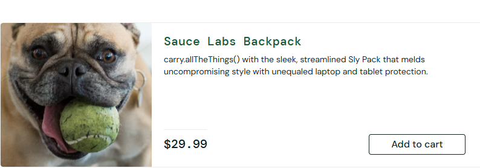
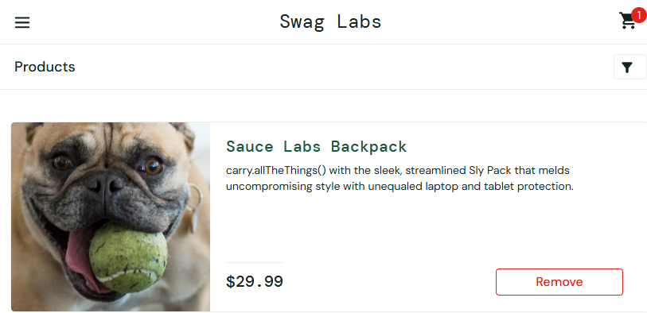

# BUG-001: [Remove] Erro ao remover produto do carrinho na Página Inicial

## 📋 Descrição
Quando um produto é adicionado ao carrinho através da página inicial (`inventory.html`) utilizando a conta `problem_user`, o botão altera seu estado para "Remove". No entanto, ao tentar remover o produto clicando neste botão, a ação trava, o botão não retorna ao estado inicial e o produto não é removido do carrinho.

---

## 🛠️ Pré-requisitos & Ambiente

### **Credenciais de Teste:**
- **URL:** [https://www.saucedemo.com/](https://www.saucedemo.com/)
- **Username:** `problem_user`
- **Password:** `secret_sauce`

### **Ambiente de Teste:**
- **Navegadores:** Google Chrome / Mozilla Firefox / Microsoft Edge / Safari
- **Sistemas Operacionais:** Windows 10 / Windows 11 / macOS

---

## 🚦 Classificação

| Campo | Valor |
| :--- | :--- |
| **Severidade** | 🔴 Alta (Falha funcional em fluxo core do sistema) |
| **Prioridade** | 🔴 Alta (Impacta diretamente a experiência de compra do usuário) |

---

## 🐾 Passos para Reproduzir

1. Acessar a aplicação [Sauce Demo](https://www.saucedemo.com/).
2. Realizar o login utilizando as credenciais do `problem_user`.
3. Na página inicial, selecionar o primeiro item **"Sauce Labs Backpack"**.
4. Clicar no botão **"Add to Cart"**.
5. Verificar que o botão "Add to Cart" muda com sucesso para **"Remove"**.
6. Verificar que o ícone do carrinho no canto superior direito passa a exibir o número **1**.
7. Clicar no botão **"Remove"** do mesmo produto.

---

## 📉 Resultados

### **Resultado Esperado:**
- O produto deve ser removido com sucesso do carrinho.
- O texto do botão deve mudar de "Remove" de volta para **"Add to Cart"**.
- O ícone do carrinho deve ser atualizado e **não deve mais exibir o número 1**.

### **Resultado Obtido:**
- A ação do botão **"Remove" trava** e não executa a remoção.
- O item **continua fixo no carrinho** e o ícone mantém a contagem "1".

---

## 📸 Evidências

### 1. Botão Tela Inicial (Printscreen)

### 2. Comportamento do Botão Travado (Printscreen)

### 3. Demonstração em Vídeo (GIF / Vídeo)
<video src="./evidences/BUG001_comportamento_do_erro.mp4" controls width="100%"></video>
